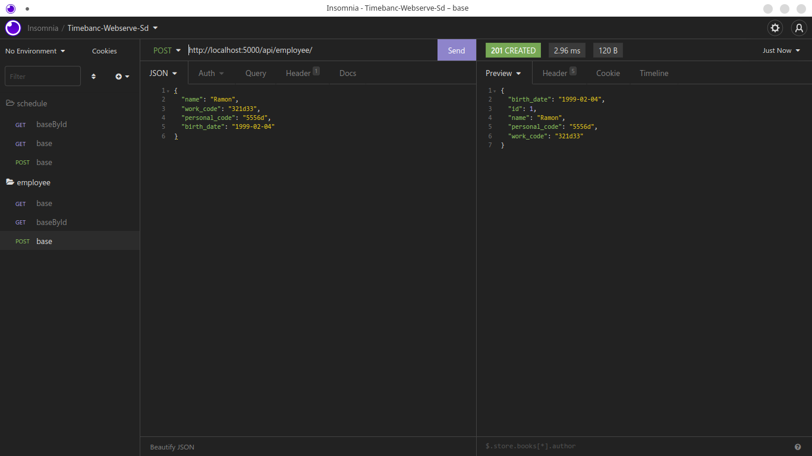
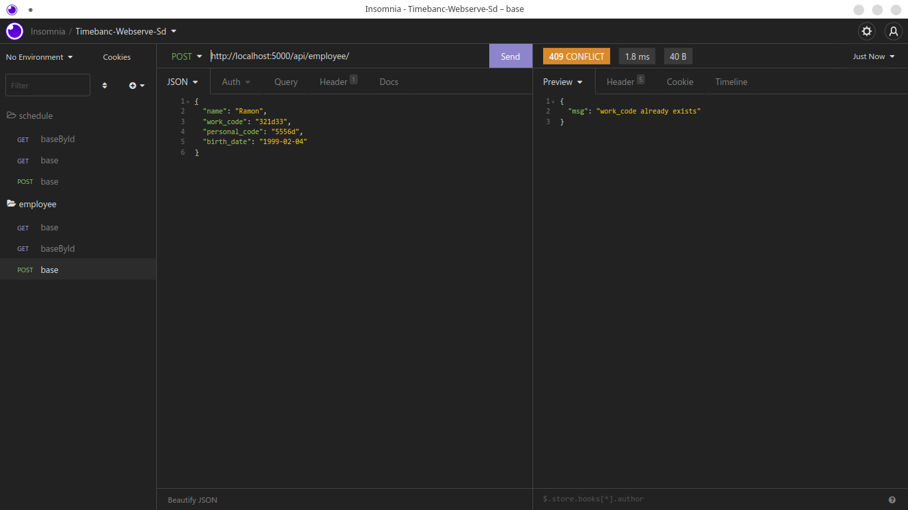
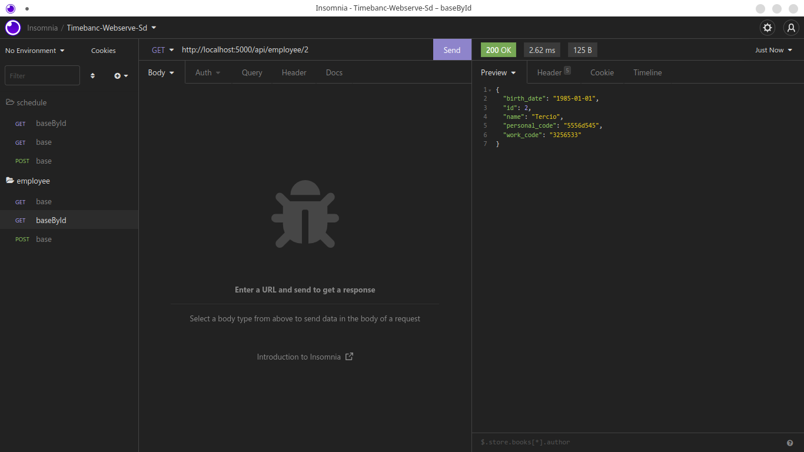
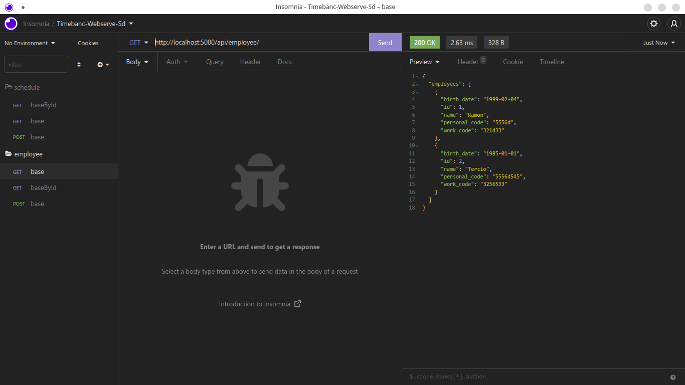
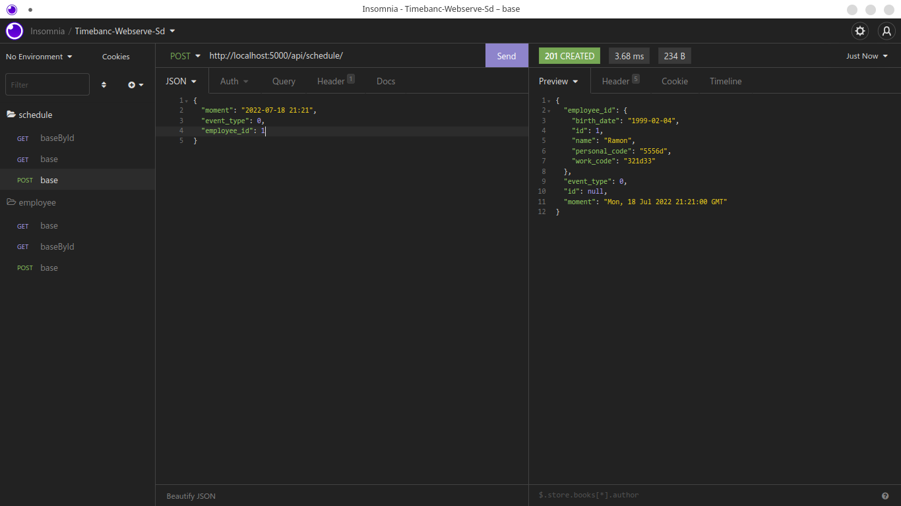
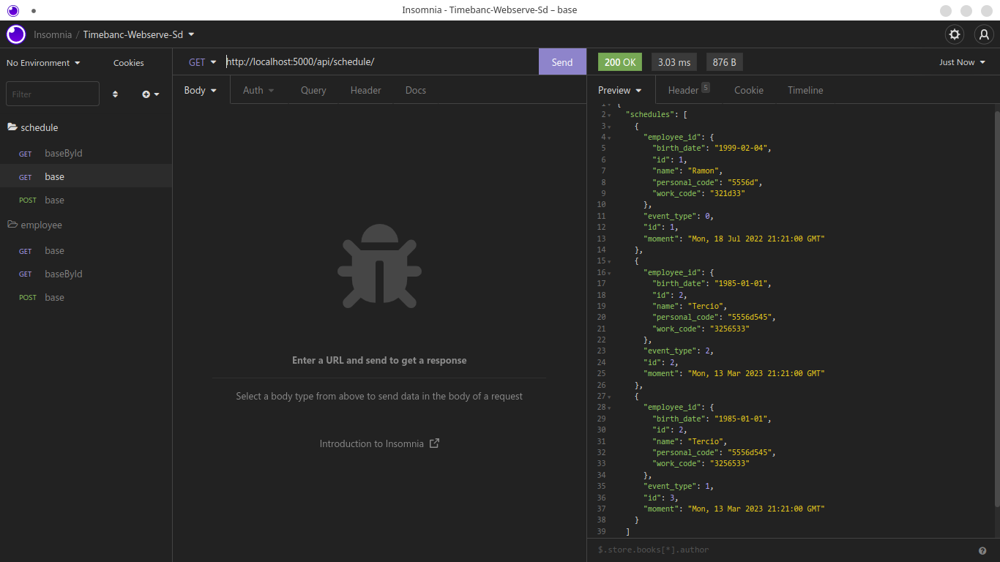
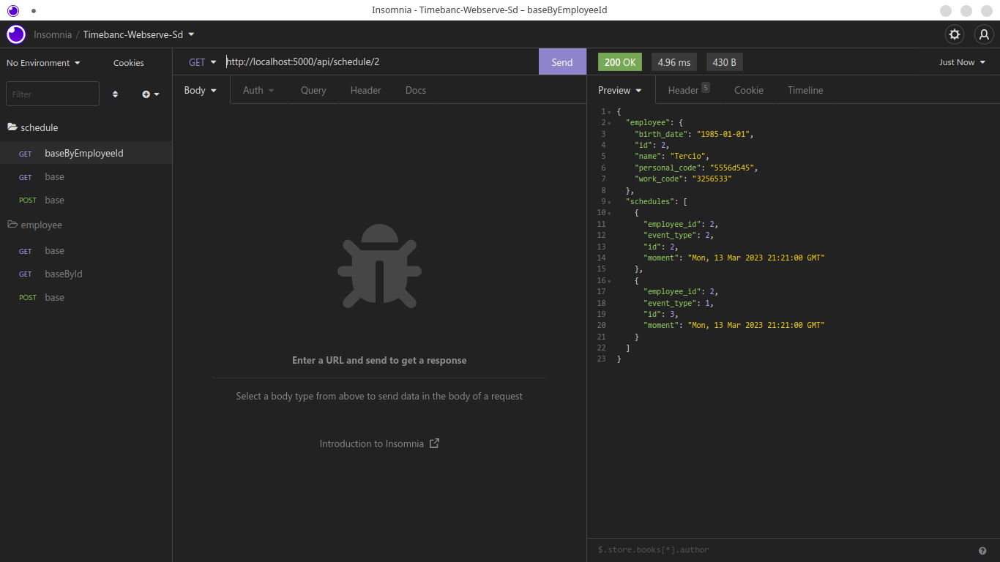

# Serviço de Nomes

**Universidade Federal de Alagoas - UFAL**

Aluno: José Ytalo Ramon de Almeida Gonçalves - 19111001

Disciplina: Sistema Distribuído (2021.1)

Professo: Tércio de Morais

Entrega: 15 de julho de 2022 às 23:59

 

## Descrição da atividade

1. O objetivo deste trabalho é implementar um serviço utilizando webservice
2. Use o estilo arquitetural REST
3. As linguagens podem ser Python ou Java
4. Evitem o uso de frameworks que tornem o serviço dependente dela
5. O material básico de webservices em Java e Python estão em anexo
6. Trabalho poderá ser feito em dupla

## Sobre o WebServer

O Timebanc-Webserve-SD é um serviço web para registro de eventos de funcinários, que registra eventos e quando eles ocorreram.

## Como executar o projeto

1. Clone o projeto: *# git clone https://github.com/jytaloramon/timebanc-webserve-sd.git*
2. Instale as dependências: *# pip install -r requirements.txt*.
3. Execute: *# python main.py*
4. Endereço de acesso: <http://localhost:5000>
5. Export o arquivo *endpoints.json* em algum software de teste de API - Insomnia, Postman, Thunder Client (VSCode extension) - para ter acesso a todos os endpoint e os formatos de requisição. 

## Execução (Screenshots)

|         |
| :------------------------------------: |
| *[POST] api/employee/ - CREATED (201)* |

|         |
| :------------------------------------: |
| *[POST] api/employee/ - CONFLIT (401)* |

|            |
| :---------------------------------------: |
| *[GET] api/employee/2 {por id}- OK (200)* |

|   |
| :------------------------------: |
| *[GET] api/employee/ - OK (200)* |

|         |
| :------------------------------------: |
| *[POST] api/schedule/ - CREATED (201)* |

|   |
| :------------------------------: |
| *[GET] api/schedule/ - OK (200)* |

|                     |
| :------------------------------------------------: |
| *[GET] api/schedule/2 {por employee id}- OK (200)* |